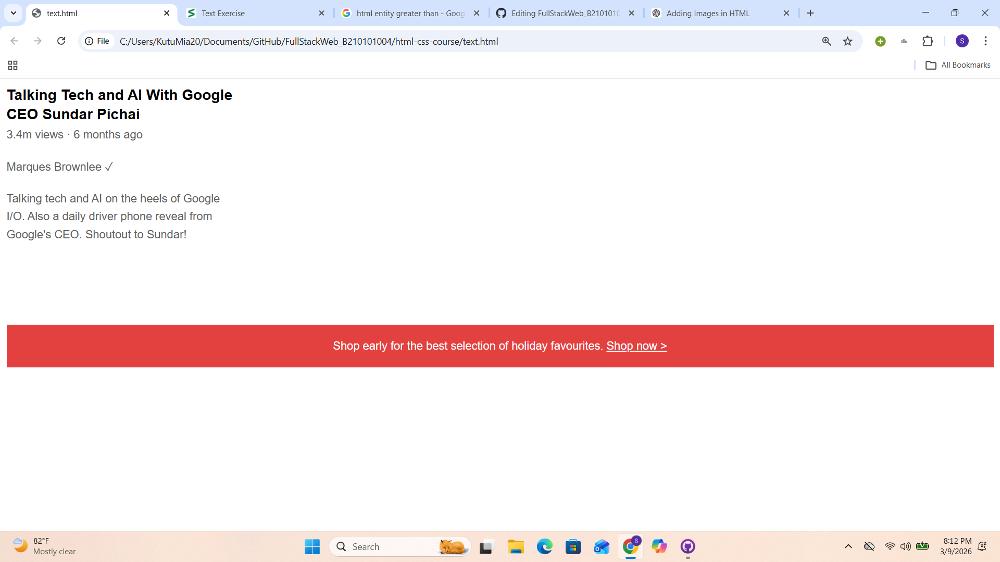
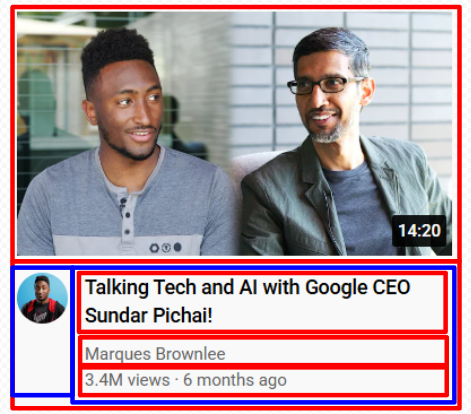
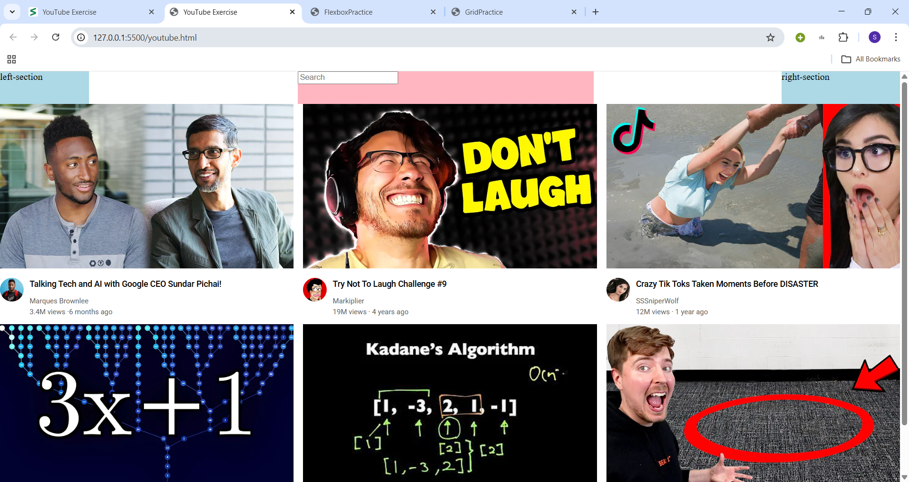
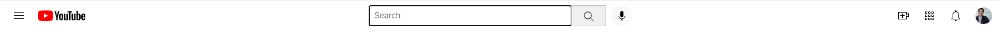
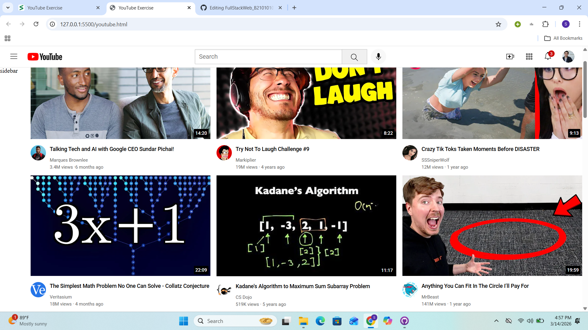
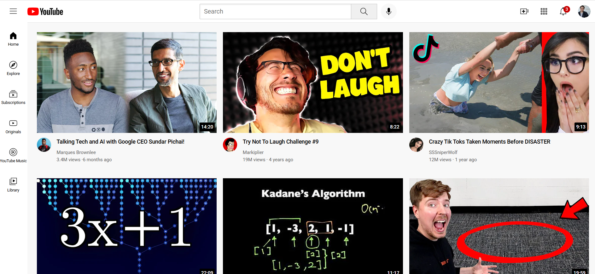

# 💻 Full Stack Web Development Project

This project is being developed for the **Software Engineering Sessional Course**.

It documents my **daily learning progress in Full Stack Web Development** including Django, HTML, CSS, and Web Layout techniques.

---

# 📚 Learning Progress

##  Week 1

### 🔹 Day 01

<details>
<summary>View Details</summary>

### ✅ Topics Learned

* Introduction to Full Stack Web Development
* What is Django
* Why use Django
* Software Installation
* Python & Django Setup
* Virtual Environment (venv)
* Creating & Activating Environment
* Django Project Structure

## ⚙️ Software Installation

* Python Installed
* VS Code Installed
* git bash Installed
* Django Installed using pip

# Django Project Setup & Running Guide

This document explains how to create a virtual environment, install Django, and run the development server.

---

## Steps Used (Git Bash)

### Create Virtual Environment

```bash
python -m venv env
env\Scripts\activate (Activation)
(env) (You will See After Activate)
pip install django
python manage.py runserver
```

# 📁 Project (Learning)

* [DjangoFrameWorkLearning](./DjangoFrameWorkLearning)

</details>

---

### 🔹 Day 02

<details>
<summary>View Details</summary>

### Topics Learned

* Django Settings Explained
* How Django Works
* URL & HttpResponse
* Django Template
* Bootstrap Integration

# Created:

* [views.py](./views.py)
* [templates](./templates)

</details>

---

### 🔹 Day 03

<details>
<summary>View Details</summary>

### ✅ Topics Learned

* Static Files in Django
* STATIC_URL, STATIC_ROOT & STATICFILES_DIRS
* Loading Static Files in Templates (``)
* Introduction to HTML
* Basic HTML Structure
* Introduction to CSS
* Linking CSS with Django Templates
* Button Design With CSS

### 🛠️ Practice Work

* Created static folder

* Added CSS file in Django project

* Connected HTML template with CSS styling

* Tested static file configuration

* [static](./static)

## For HTML-CSS Practice(Practice Work)

* [html-css-course](./html-css-course)

</details>

---

### 🔹 Day 04

<details>
<summary>View Details</summary>

### ✅ Topics Practiced

* CSS Hover Effects

* CSS Transitions

* Shadow

* [html-css-course](./html-css-course)

</details>

---

### 🔹 Day 05

<details>
<summary>View Details</summary>

### ✅ Topics Practiced

* Chrome Dev Tools

* CSS Box Model

* [html-css-course](./html-css-course)

</details>

---

### 🔹 Day 06

<details>
<summary>View Details</summary>

This is my practice project using HTML and CSS.

## Practiced



</details>

---

### 🔹 Day 07

<details>
<summary>View Details</summary>

Day 07 – HTML Structure & Basic Webpage Setup

Today I learned the basic structure of an HTML webpage and how different parts of a website are organized. I practiced creating a simple webpage and connecting it with CSS for styling.

## Topics I Learned

**HTML Structure**

```html
<!DOCTYPE html>
<html lang="en">
<head>
<meta charset="UTF-8">
<meta name="viewport" content="width=device-width, initial-scale=1.0">
<title>Document</title>
</head>

<body>

</body>
</html>
```

**Title Tag**

**Live Server**

Used the Live Server extension to automatically run and preview the website in the browser.

**Linking CSS File**

```html
<link rel="stylesheet" href="styles/text.css">
```

**Adding New Fonts**

Learned how to change the font of text using the `font-family` property in CSS.

</details>

---

#  Week 2

### 🔹 Day 01

<details>
<summary>View Details</summary>

## 📚 Topics Practiced Today

Today I practiced some important HTML and CSS concepts related to layout and elements.

### Images and Text Boxes

* Learned how to insert images using the `` tag.
* Practiced controlling image size using `width` and `height`.
* Used text boxes with the `<input type="text">` element.
* Styled input fields using CSS.

### CSS Display Property

* block
* inline
* inline-block
* none

### The DIV Element

* Practiced using the `<div>` element to group HTML elements.

### Nested Layout Technique

* Learned how to place `div` elements inside other `div` elements.



## 🛠️ Technologies Used

* HTML5
* CSS3

## Practices (YouTube Design)


</details>

---

### 🔹 Day 02

<details>
<summary>View Details</summary>

Today I practiced **CSS Flexbox** and **CSS Grid**.

### 📌 Topics Covered

CSS Flexbox

* display: flex
* flex-direction
* justify-content
* align-items
* flex-wrap

CSS Grid

* display: grid
* grid-template-columns
* grid-template-rows
* gap

### 🛠 Practice



</details>

---

### 🔹 Day 03
<details> <summary>View Details</summary>

Today I practiced Nested Flexbox and built a YouTube Header layout.

📌 Topics Covered

Nested Flexbox

Using flexbox inside another flex container

Creating complex layouts with nested flex

Aligning items in multi-level flex structures

Combining justify-content and align-items in nested layouts

🛠 Practice

Practiced building a YouTube Header Layout

Structured the header using Nested Flexbox


</details>
  
---


### 🔹 Day 04

<details>
<summary>View Details</summary>

Today I practiced **CSS Position** and learned how elements can be placed precisely on a webpage.

### 📌 Topics Covered

CSS Position

* position: static  
* position: relative  
* position: absolute  

### 🛠 Practice

I practiced how **relative** and **absolute positioning** work together to control the placement of elements inside a container.



</details>

---


### 🔹 Day-05
<details> 

<summary>View Details</summary>

Today I completed the YouTube UI practice project by focusing on the Toolkit (Header Section) and Sidebar layout, along with making several visual and structural adjustments.

### 📌 Topics Covered

YouTube Layout Completion

Header / Toolkit Design

Sidebar Navigation Layout

Alignment and Spacing Adjustments

Consistent UI Styling

Improving Layout Structure

### 🛠 Practice

Designed and adjusted the top toolkit (header) including icons and layout alignment

Built and refined the sidebar section for better navigation structure

Fixed spacing, margins, and alignment issues across the layout

Improved overall UI consistency to closely match a real-world YouTube interface

### 📸 Final Output:



</details>

---

### 🔹 Day-06
<details> <summary>View Details</summary>

Today I focused on improving my CSS knowledge by learning Responsive Design techniques, along with important core concepts like shorthand properties, inheritance, specificity, and semantic HTML elements.

### 📌 Topics Covered

### Responsive Design

Media Queries
Flexible Layouts
Mobile-Friendly Design

### CSS Shorthand

margin, padding shorthand
background shorthand
font shorthand

### CSS Inheritance

How styles pass from parent to child
Default inherited properties

### CSS Specificity

Priority of selectors
Inline vs ID vs Class vs Element

### Semantic Elements

```html
<header>
<nav>
<section>
<article>
<footer>
```
  
### 🛠 Practice
Practiced creating responsive layouts using media queries for different screen sizes

Used CSS shorthand properties to write cleaner and more efficient code

Explored how inheritance works and how styles cascade through elements

Tested different selectors to understand CSS specificity and priority

Structured a webpage using semantic HTML elements for better readability and SEO

</details>

---

## 🔹 Day - 07
<details>
<summary>View Details</summary

I have started learning Python, which is essential for understanding Django. Python is a simple and powerful programming language used in web development.
                       
### Topics Learned

* Python Fundamentals
* File Handling (read, write, modes)
* Exception Handling (try, except, finally)
* Lambda, Map, Filter Functions
* Working with Lists, Dictionaries
* String Operations (split, strip)
* Basic Problem Solving

### Created:

* 🔗 [Python_Code Folder](https://github.com/Himel738/AI-ML-Playground/tree/main/Python_Code)

</details>

---
# Week-03

### 🔹 Day - 01
<details>
<summary>View Details</summary

## Java Script Basic Foundation
This folder contains my JavaScript basics practice and learning journey. It includes fundamental concepts, examples, and small exercises that helped me build a strong foundation in JavaScript.

</details>

---

### 🔹 Day - 02
<details>
<summary>View Details</summary

# PortFolio-Project - https://portfolioshohan20.netlify.app/
</details>

---

### 🔹 Day - 03
<details>
<summary>View Details</summary

## Advanced Java Script
- Rest_API
- ES6 Promises And Async Programming
</details>

---

### 🔹 Day - 04
<details>
<summary>View Details</summary
                       
Complete a Simple TO-Do App using JS
</details>

---

### 🔹 Day - 05
<details>
<summary>View Details</summary
                       
- What is Django & History_Features of Django
- Building Django Apps, Models, Views and Template

</details>

---

### 🔹 Day - 06
<details>
<summary>View Details</summary
                       
- Form and Crud Essentials

</details>

---

### 🔹 Day - 07
<details>
<summary>View Details</summary
                       
- Templates & Middleware Mastery

</details>

---

## Week - 04

### 🔹 Day - 01
<details>
<summary>View Details</summary
                       
- Mastering Database and Relationships

</details>

---

### 🔹 Day - 02
<details>
<summary>View Details</summary
                       
- User Authentication and Session Management

</details>

---

### 🔹 Day - 03
<details>
<summary>View Details</summary
                       
# - Start The Full Functional Industry Level Blog Project - https://github.com/Himel738/django-blog

- Creating SuperUser
- Implementing Template
- Design Homepage and Configure Static File
- Setup Git With gitignore

</details>

---

### 🔹 Day - 04
<details>
<summary>View Details</summary
                       
# - Progress-02

- Category Model
- Media File Configuration
- Blog Model
- Prepopulate Slugs
- Admin title List Display

</details>

---

### 🔹 Day - 05
<details>
<summary>View Details</summary
                       
# - Progress-03

- Add Demo Categories and Blog Post
- Display Featured Post on HomePage
- Display Recent Articles
- Foreign Key Relationships
- Post By Category
- Custom Error Page
- Template Inheritance
- Context Processor
- Linking Post By Category URL

</details>

---

### 🔹 Day - 06
<details>
<summary>View Details</summary
                       
# - Progress-04

- Single Blog Page Setup
- Build About Us and Social Links
- Display Social Links On Blog Pages
- Search Feature

</details>

---

### 🔹 Day - 07
<details>
<summary>View Details</summary
                       
# - Progress-05

- Registration Setup
- User Creation Form
- Register Functinality
- Login Feature

</details>

---

## Week - 05

### 🔹 Day - 01
<details>
<summary>View Details</summary

# - Progress - 06
                       
- Authentication and Authorization
- Groups
- Editor and Manager Dashboards
- Dashboard URL Configuration
- Dashboard Design
- Blogs and Category Count
- Login Required
- Category Table
- Add Category
- Edit Category
- Delete Category

</details>

---

### 🔹 Day - 02
<details>
<summary>View Details</summary

# - Progress - 07
                       
- Blog Post Table
- Add New Post
- Add Post - Assign Logged-in-user to author
- Add Post With Unique Slug
- Edit Blog Post
- Delete Blog Post
- Login Required

</details>

---

### 🔹 Day - 03
<details>
<summary>View Details</summary

# - Progress - 08
                       
- Manager Dashboard
- Conditionally Show the USer
- Add User
- Add User Feature
- Prevent Editor Perform
- Edit User Form
- Edit User Functionality
- Delete User Functionality

</details>

---

### 🔹 Day - 04
<details>
<summary>View Details</summary

# - Progress - 09
                       
- Display Comment
- Create Comment form
- Add Comment
- Allow Only Authrize User to Write Comment

</details>

---

### 🔹 Day - 05
<details>
<summary>View Details</summary

# - Progress - 10
                       
- Forget Password Feature
- Email Verification
- Improvement on editor and User Dashboard with some modification
  
</details>

---

### 🔹 Day - 06
<details>
<summary>View Details</summary

# - Start The Rest API of Django:

# - Progress - 10
                       
- Web Application Endpoint
- Simple API Endpoint
- Create Model
- Manual Serialization
- Serializers
  
</details>

---

### 🔹 Day - 07
<details>
<summary>View Details</summary


# - Progress - 11
                       
- Function-BAsed View Get Method
- Sorting Data Using Serializers
- Get A single Object Primart Key-BAsed Operation
- Update Operation on Student
- Delete Operation
  
</details>

---

## Week - 06

### 🔹 Day - 01
<details>
<summary>View Details</summary

# - Progress - 12
                       
- Class BAsed View Function
- Employee Model
- Employee Serializers
- Class Base View- Get All Employee
- Class Base View- Creating Employee
- Update and Delete Employee

</details>

---

### 🔹 Day - 02
<details>
<summary>View Details</summary

# - Progress - 13
                       
- Mixins Overview
- Generics Overview
- Viewsets Introduction

</details>

---


